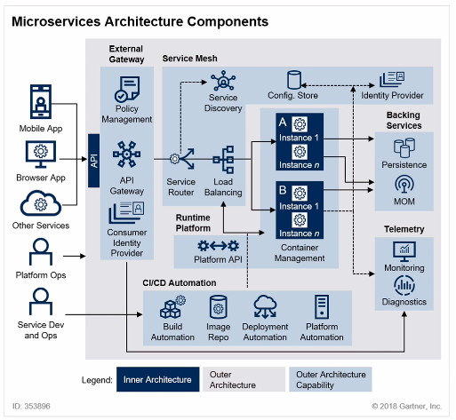
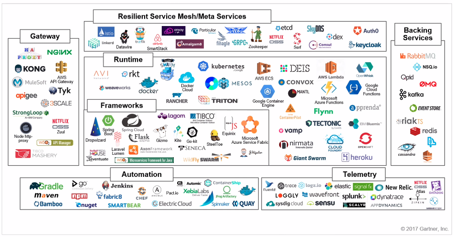

# MSA 표준 구성요소

## 컴포넌트 구성 요소

- Service Discovery
- API Gateway
- Context Boundary

## Service Mesh
- Discovery
- Router
- Balancer
- 서비스 간의 통신을 추상화한 인프라스트럭쳐 레이어
    - 프록시, 인증, 권한, 암호화, 서비스 검색, 요청 라우팅, 로드밸런싱 등..

## CNCF (Cloud Native Computing Foundation)
- Cloud Native Interactive Landscape
- https://landscape.cncf.io/

## MSA 기반 기술

