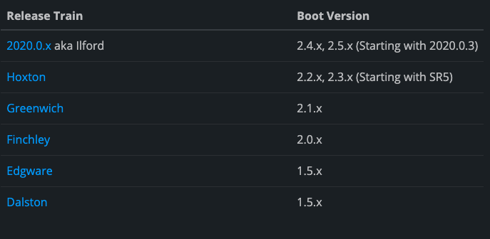

# Spring Cloud 란 ?

## Spring Boot + Spring Cloud

- 스프링 부트와 스프링 클라우드를 연동해서 사용함

`환경 설정`
- Spring Cloud Config Server

`서비스 등록 및 검색`
- Eureka (Naming Server)

`로드 밸런싱 / 게이트웨이`
- Ribbon
- Gateway (Zuul -> 최신버전은 Gateway 권장)

`REST Clients`
- Feign Client

`시각화 모니터링`
- Zipkin Tracing
- Netflix API Gateway

`장애 복구`
- Hystrix