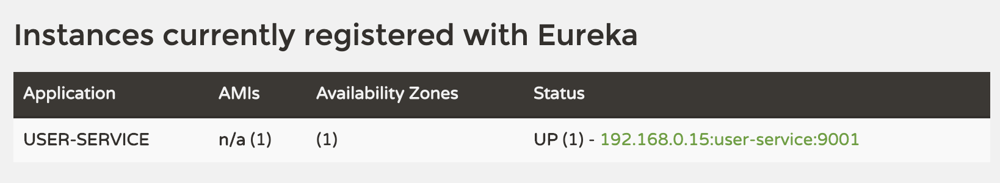

# User Service 등록

## Eureka Client 생성 및 등록

```java
@SpringBootApplication
@EnableDiscoveryClient // DiscoveryClient 를 구현한것이 EurekaClient ...
public class UserServiceApplication {

	public static void main(String[] args) {
		SpringApplication.run(UserServiceApplication.class, args);
	}

}
```
- EnableDiscoveryClient, EnableEurekaClient 두가지 애노테이션이 있다.
- 둘중 어느것을 사용해도 좋지만 DiscoveryClient 는 표준 스펙, EurekaClient 는 이를 구현한 구현체이고 여기서는 @EnableDiscoveryClient 를 사용한다.

```yaml
server:
  port: 9001

spring:
  application:
    name: user-service

# Eureka 등록 및 외부 검색 허용 설정
eureka:
  client:
    register-with-eureka: true
    fetch-registry: true
    service-url:
      defaultZone: http://localhost:8761/eureka # Eureka 서버 정보

```

위와 같이 Eureka Client 를 설정한 뒤 서버를 기동하면 (Eureka Service 가 구동중이어야 한다.) 다음과 같이 Eureka Service DashBoard 에 서비스가 등록된걸 확인할 수 있다.

