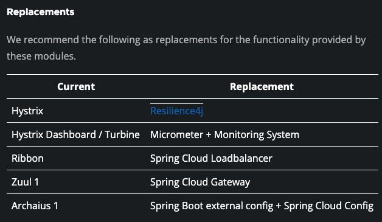

# API Gateway 란 ?

## 역할
- 사용자가 지정한 라우팅 설정에 따라 각 END-POINT 로 클라이언트 대신 요청/응답을 받아 클라이언트에게 다시 제공해주는 Proxy 역할을 수행한다.
- 시스템 내부의 구현을 숨기고 적절현 형태로 가공해서 응답할 수 있다.

## 장점
- 인증 / 권한 부여
- 서비스 검색 통합
- 응답 캐싱
- 정책 / 회로 차단기 및 QoS (Quality Of Service) 다시 시도
  - 한정된 네떡 자원 내에서 특정 트래픽이 일정 수준의 성능 / 속도를 유지하도록 보장받는 기술
- 속도 제한
- 부하 분산
- 로깅 추적 상관 관계
- 헤더 쿼리 문자열 청구 변환
- IP 허용 목록에 추가

## Netflix Ribbon
- Spring Cloud 에서의 통신 방식
1. RestTemplate
    - 전통적인 HTTP Client 통신 방식 
2. FeignClient
    - 선언적인 Client 방식
    - 외부 서비스를 마치 내부의 Service 처럼 호출할 수 있음
    
- Ribbon : **Client Side** Load Balancer
    - 서비스 이름으로 호출
    - Health Check
> 비동기 처리가 잘 되지 않는다. 
> Spring Cloud Ribbon 은 Spring Boot 2.4 에서 **Maintenance 상태**

`Maintenace 상태란 ?`
- 모듈을 유지 관리 모드로 두는것
- 새로운 기능을 개발하지 않는다.

## Netflix Zuul
- Netflix Zuul
    - API Gateway
- First Service
- Second Service

> Client 에서는 Zuul 에게 요청을 보내고, Zuul 이 Gateway 역할을 수행한다.
> Spring Cloud Zuul 은 Spring Boot 2.4 에서 Maintenance 상태
> https://spring.io/blog/2018/12/12/spring-cloud-greenwich-rc1-available-now#spring-cloud-netflix-projects-entering-maintenance-mode

## 참고

