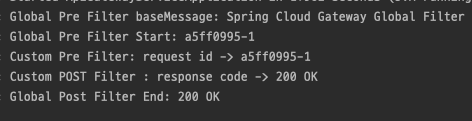

# Spring Cloud API Gateway Custom Filter

## Spring Cloud API Gateway Global Filter
- 특정 라우터에만 적용되는것이 아닌 모두 적용되는 Global Filter 설정이 가능하다.
- 이는 가장 먼저 Pre Filter 가 적용되고, 가장 나중에 Post Filter 가 적용된다.

## Global Filter 구현
- Filter 의 구현은 CustomFilter 와 동일한 방식을 취한다.
```java
@Slf4j
@Component
public class GlobalFilter extends AbstractGatewayFilterFactory<GlobalFilter.Config> {

	public GlobalFilter() {
		super(Config.class);
	}

	@Override
	public GatewayFilter apply(Config config) {
		// Pre Filter
		return (exchange, chain) -> {
			ServerHttpRequest request = exchange.getRequest();
			ServerHttpResponse response = exchange.getResponse();
			log.info("Global Pre Filter baseMessage: {} ", config.getBaseMessage());

			if (config.isPreLogger()) {
				log.info("Global Pre Filter Start: {}", request.getId());
			}

			// Post Filter
			return chain.filter(exchange).then(Mono.fromRunnable(() -> {
				if (config.isPreLogger()) {
					log.info("Global Post Filter End: {}", response.getStatusCode());
				}
			}));
		};
	}

	@Data
	public static class Config {
		private String baseMessage;
		private boolean preLogger;
		private boolean postLogger;
	}
}
```

## Global Filter 등록

```yaml
spring:
  application:
    name: apigateway-service
  cloud:
    gateway:
      default-filters:
        - name: GlobalFilter
          args:
            baseMessage: Spring Cloud Gateway Global Filter
            preLogger: true
            postLogger: true
      routes:
        - id: first-service
          uri: http://localhost:8081/
          predicates:
            - Path=/first-service/** # http://localhost:8081/first-serivce/** 형태로 그대로 전달됨을 주의..
          filters:
#            - AddRequestHeader=first-request, first-request-header
#            - AddResponseHeader=first-response, first-response-reader
            - CustomFilter
        - id: second-service
          uri: http://localhost:8082/
          predicates:
            - Path=/second-service/**
          filters:
#            - AddRequestHeader=second-request, second-request-header
#            - AddResponseHeader=second-response, second-response-reader
            - CustomFilter
```


`Filter 동작 결과`

