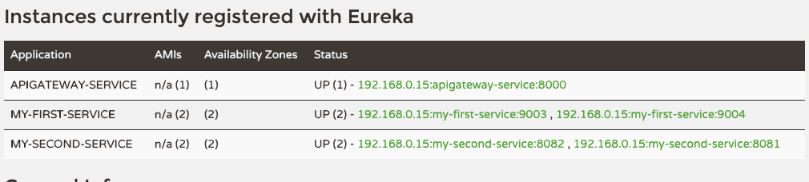

# Spring Cloud API Gateway Custom Filter

## Spring Cloud API Gateway Eureka 연동

`GatewayService`

```yaml

eureka:
  client:
    register-with-eureka: true
    fetch-registry: true
    service-url:
      defaultZone: http://localhost:8761/eureka
spring:
  application:
    name: apigateway-service
  cloud:
    gateway:
      default-filters:
        - name: GlobalFilter
          args:
            baseMessage: Spring Cloud Gateway Global Filter
            preLogger: true
            postLogger: true
      routes:
        - id: first-service
#          uri: http://localhost:8081/
          uri: lb://MY-FIRST-SERVICE # Discovery-Service 에 등록된 서비스 네임으로 접근
          predicates:
            - Path=/first-service/** # http://localhost:8081/first-serivce/** 형태로 그대로 전달됨을 주의..
        - id: second-service
#          uri: http://localhost:8082/
          uri: lb://MY-SECOND-SERVICE
          predicates:
            - Path=/second-service/**
```
- 기존의 FirstService, SecondService 도 마찬가지로 eureka 서버에 등록이 된 상태여야 한다.
- GatewayService 의 변동사항중 유의할점은 uri 를 직접 입력하는것이 아닌 lb://${SERVICE_NAME} 형태로 접근하는것

## SCG - Eureka 연동

`각 서비스별 MultiInstance 구동`

```shell
./mvnw spring-boot:run -Dspring-boot.run.jvmArguments='-Dserver.port=9003'
```

`Eureka Service 연동 확인`



## 참고
- 필요하다면 Weight 를 지정해서 로드밸런싱도 가능하다.
    - https://cloud.spring.io/spring-cloud-gateway/reference/html/#the-weight-route-predicate-factory