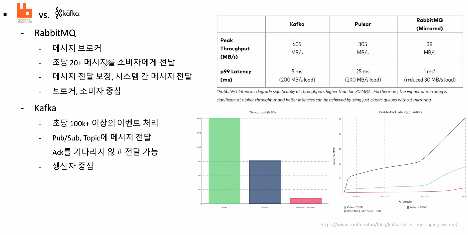

# Spring Cloud Bus

## Config 변경시 반영 방법
- 서버 재기동
- Actuator Refresh
- **Spring Cloud Bus**
    - 분산 시스템의 노드를 경량 **메세지 브로커** 와 연결
    - 상태 및 구성에 대한 변경 사항을 연결된 노드에게 Broadcast 방식으로 전달한다.

## 메세지 브로커
- AMQP (Advanced Message Queuing Protocol)
    - 메세지 지향, 신뢰성, 보안
    - Erlang, RabbitMQ
    - 대표적인 RabbitMQ 를 사용함
- Kafka
    - 분산형 스트리밍 플랫폼
    - 대용량 데이터를 처리 가능한 메시징 시스템
    - 메시지 브로커 보다 **이벤트 브로커** 로 더 많이 사용한다.

## Actuator bus-refresh Endpoint
- 분산 시스템의 노드를 메세지 브로커와 연결
- 상태 및 변경 사항을 연결된 노드에게 전달
    - 어떤 서비스의 Endpoint를 호출 하던지, 1번 호출하면 해당 Cloud Bus 에 연결된 나머지 노드에게 전파된다.