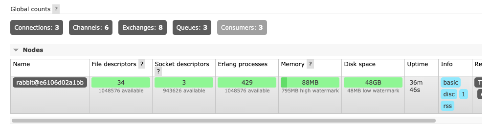

# AMQP

## 의존성 추가

`Config Server 의존성`

```xml
<dependency>
    <groupId>org.springframework.boot</groupId>
    <artifactId>spring-boot-starter-actuator</artifactId>
</dependency>

<dependency>
    <groupId>org.springframework.cloud</groupId>
    <artifactId>spring-cloud-starter-bus-amqp</artifactId>
</dependency>
```

`UserService / Gateway Server 의존성`

```xml
<dependency>
    <groupId>org.springframework.cloud</groupId>
    <artifactId>spring-cloud-starter-bus-amqp</artifactId>
</dependency>
```

## yaml 파일 설정

```yaml
spring:
  rabbitmq:
    host: 127.0.0.1
    port: 5672
    username: guest
    password: guest

management:
  endpoints:
    web:
      exposure:
        include: refresh, health, beans, busrefresh # Actuator 를 활성화 시킬 End-Point 설정
```
- rabbitmq 접속 정보와, actuator end-point 중 busrefresh 를 추가한다.

> Spring Cloud 2.0.0 에서 end-point 의 이름이 변경됨.. bus-env -> busenv / bus-refresh -> busrefresh


## RabbitMQ Admin
- RabbitMQ 에서 기본적으로 Admin 을 제공한다.
- 위 설정이 끝난후 각 마이크로서비스들을 기동하면 다음과 같이 springCloudBus 토픽으로 연결됨을 확인할 수 있다.




