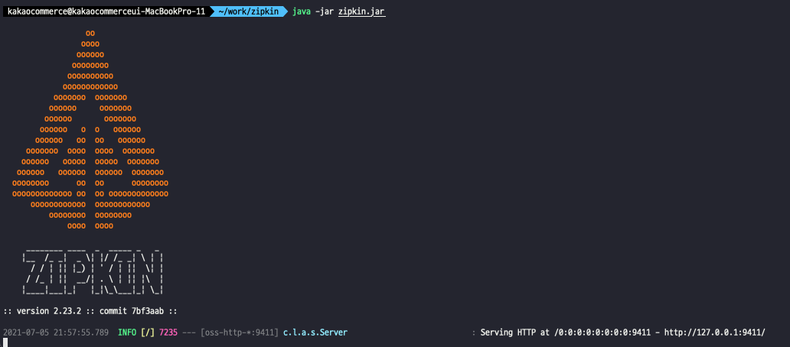

# Zipkin
- https://zipkin.io/
- Twitter 에서 사용하는 분산 환경 Timing 데이터 수집, 추적 시스템
- Google Drapper 에서 발전, 분산환경에서 시스템 병목 현상 파악
- Collector, Query Service, Databasem WebUI 로 구성된다.

`Span`
- 하나의 요청에 사용되는 작업 단위
- 64 bit unique ID

`Trace`
- 트리 구조로 이뤄진 Span Set
- 하나의 요청에 대한 같은 Trace ID 를 발급

## Spring Cloud Sleuth


- Spring Boot + Zipkin 연동
- 요청 값에 대한 TraceID, Span ID 부여
- Trace 와 Span Ids 를 로그에 추가
    - servlet filter
    - rest template
    - scheduled actions
    - message channel
    - feign client

- 하나의 요청단위를 묶는것 : Trace ID
    - 각 MSA 간의 통신시 Span ID 가 새롭게 발견됨
    - 하나의 Trace ID 로 묶이기 때문에 하나의 단위 트랜잭션으로 취급된다.

> 쪼개진 MSA 간의 통신시 문제가 발생한 곳의 추적을 위해 사용

## Quick Start

```shell
curl -sSL https://zipkin.io/quickstart.sh | bash -s
java -jar zipkin.jar
```
- QuickStart 로 Zipkin 서버를 간단히 실행이 가능하다.



## 설정

`의존성 추가`

```xml
<dependency>
    <groupId>org.springframework.cloud</groupId>
    <artifactId>spring-cloud-starter-sleuth</artifactId>
</dependency>

<dependency>
    <groupId>org.springframework.cloud</groupId>
    <artifactId>spring-cloud-starter-zipkin</artifactId>
    <version>2.2.3.RELEASE</version>
</dependency>
```

`application.yml`

```yaml
spring:
  zipkin:
    base-url: http://127.0.0.1:9411
    enabled: true
  sleuth:
    sampler:
      probability: 1.0
```

```java
@Slf4j
@Service
@Transactional(readOnly = true)
@RequiredArgsConstructor
public class UserService implements UserDetailsService {
	private final UserRepository repository;
	private final PasswordEncoder passwordEncoder;
	private final ModelMapper mapper;

	private final RestTemplate restTemplate;
	private final Environment env;

	private final OrderServiceClient orderServiceClient;
	private final CircuitBreakerFactory circuitBreakerFactory;

	public UserDto getUserById(String userId) {
		User user = repository.findByUserId(userId)
				.orElseThrow(RuntimeException::new);
		UserDto userDto = mapper.map(user, UserDto.class);

		/*
		RestTemplate
		String orderUrl = String.format(env.getProperty("order_service.url"), userId);
		ResponseEntity<List<ResponseOrder>> ordersResponse = restTemplate.exchange(
			orderUrl,
			HttpMethod.GET,
			null,
			new ParameterizedTypeReference<List<ResponseOrder>>() {} // Super Type Token
		);
		List<ResponseOrder> responseOrders = ordersResponse.getBody();
		*/


		// FeignClient
//		List<ResponseOrder> responseOrders = orderServiceClient.getOrders(userId);

		// CircuitBreaker
		log.info("Before call order msa");
		CircuitBreaker circuitbreaker = circuitBreakerFactory.create("circuitbreaker");
		List<ResponseOrder> responseOrders = circuitbreaker.run(() -> orderServiceClient.getOrders(userId),
			throwable -> new ArrayList<>());
		log.info("After call order msa");

		userDto.setOrders(responseOrders);
		return userDto;
	}
```