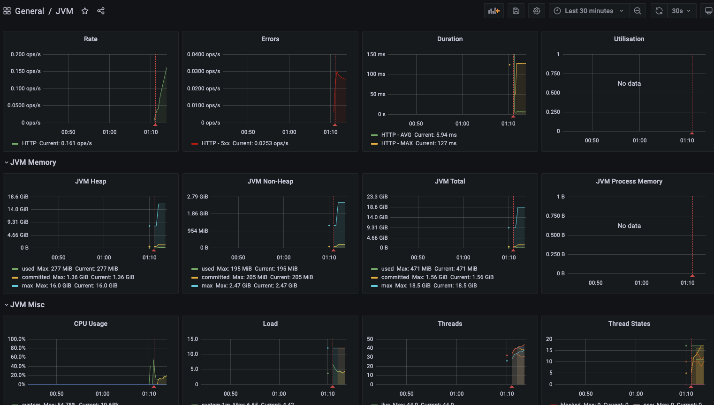

# Prometheus Grafana

## Prometheus
- Metrics 를 수집하고 모니터링 및 알람에 사용되는 오픈소스 애플리케이션
- 2016 부터 CNCF 에서 관리되는 2번째 공식 프로젝트
    - Level DB -> Time Series Database (TSDB)
    - Level DB 에서 TSDB 로 변경됨
- Pull 방식 구조와 다양한 Metrics Exporter ㅈ공
- 시계열 디비에 Metrics 저장 -> 조회 가능 (Query)

## Grafana
- 데이터 시각화, 모니터링 및 분석을 위한 오픈소스 애플리케이션
- 시계열 데이터를 시각화 하기 위한 대시보드 제공

## Prometheus 설치 및 실행
- https://prometheus.io/download/
- https://grafana.com/grafana/download

```shell
curl -OL https://github.com/prometheus/prometheus/releases/download/v2.28.1/prometheus-2.28.1.darwin-amd64.tar.gz
curl -O https://dl.grafana.com/oss/release/grafana-8.0.5.darwin-amd64.tar.gz

tar -xvzf ...
```


`Prometheus 설정`

```yaml
# my global config
global:
  scrape_interval:     15s # Set the scrape interval to every 15 seconds. Default is every 1 minute.
  evaluation_interval: 15s # Evaluate rules every 15 seconds. The default is every 1 minute.
  # scrape_timeout is set to the global default (10s).

# Alertmanager configuration
alerting:
  alertmanagers:
    - static_configs:
        - targets:
          # - alertmanager:9093

# Load rules once and periodically evaluate them according to the global 'evaluation_interval'.
rule_files:
# - "first_rules.yml"
# - "second_rules.yml"

# A scrape configuration containing exactly one endpoint to scrape:
# Here it's Prometheus itself.
scrape_configs:
  # The job name is added as a label `job=<job_name>` to any timeseries scraped from this config.
  - job_name: 'prometheus'

    # metrics_path defaults to '/metrics'
    # scheme defaults to 'http'.

    static_configs:
      - targets: ['localhost:9090']
  - job_name: 'user-service'
    scrape_interval: 15s
    metrics_path: '/user-service/actuator/prometheus'
    static_configs:
      - targets: ['localhost:8000']
  - job_name: 'order-service'
    scrape_interval: 15s
    metrics_path: '/order-service/actuator/prometheus'
    static_configs:
      - targets: ['localhost:8000']
  - job_name: 'apigateway-service'
    scrape_interval: 15s
    metrics_path: '/actuator/prometheus'
    static_configs:
      - targets: ['localhost:8000']
```

`Prometheus 실행`

```shell
// 설정파일을 argument 로 제공
.prometheus --config.file=prometheus.yml
```

`Prometheus Dashboard`
- http://localhost:9090/


`Grafana 실행`

```shell
./bin/grafana-server
```

`Grafana Dashboard`
- 초기 ID/PW : admin/admin
- 최초 접속시 password 변경 유도


## Grafana - Prometheus 연동


- Configuration - DataSources - Add data sources - Prometheus 설정


- Dashboards - Manage - Import 를 통해 Dashboard Template 사용 가능

[JVM](https://grafana.com/grafana/dashboards/11892)

[Prometheus 2.0 Overview](https://grafana.com/grafana/dashboards/3662)

[Spring Cloud Gateway](https://grafana.com/grafana/dashboards/11506)

> Prometheus 에 저장된 메트릭을 이용해 시각화 가능..

