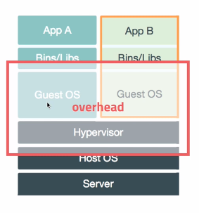

# Container Visualization

## Visualization
- 물리적인 컴퓨터 리소스를 다른 시스템 혹은 애플리케이션에서 사용할 수 있도록 제공하는 기술
    - 플랫폼 가상화
    - 리소스 가상화
- 하이퍼바이저 (Hypervisor)
    - 가상화를 위해 필요함
    - Virtual Machine Manager (VMM)
    - 다수의 운영체제를 동시에 실행하기 위한 논리적인 플랫폼
    - Type 1 : Native or Bear-metal
    - Type 2 : Hosted

> 운영체제 하에 가상화를 한다면 Hosted 방식 

## Container Visualization



- OS Visualization
    - Host OS 위에 Guest OS 전체를 가상화
    - 호스트 OS 위에 OS 를 띄우는 방식
    - VMWare, VirtualBox
    - 자유도가 높지만, **시스템 부하** 가 많고 느리다.
    


- Container Visualization
    - Host OS 가 가진 리소스를 적게 사용하고, 필요한 프로세스를 실행
    - 최소한의 라이브러리와 도구만 포함한다.
    - Container 의 생성 속도가 빠르다.
    - Hypervisor 에 존재할 위치에 Container Engine 이 위치하고, 별도의 OS 를 띄우는것이 아닌 **하나의 프로세스** 로 동작한다 
    
> OS Visualization 보다 Container Visualization 이 훨씬 가볍고, 속도가 빠르다.

## Container Image
- Container 실행에 필요한 설정 값
    - 상태를 가지지 않음, Immutable
- Image 를 가지고 실체화 -> Container
- Image Registry (이미지 저장소)
    - Public Registry (Docker Hub)
    - Private Registry (별도 서버로 운영 가능)
- 컨테이너 서버 (Docker Host)
    - 이미지가 저장될 수 있는 Local Repository 가 존재한다.
        - Registry 를 통해 다운받은 이미지가 저장되어 있음
    - Local Repository 에 존재하는 이미지로 컨테이너를 실행할 수 있음

## DockerFile
- Docker Image 를 생성하기 위한 스크립트 파일
- 자체 DSL 을 제공 -> 이미지 생성 과정을 기술한다.

```dockerfile
FROM mysql:5.7

ENV MYSQL_ALLOW_EMPTY_PASSWORD true
ENV MYSQL_DATABASE mydb

ADD ../db_mount /var/lib/mysql

EXPOSE 3306

CMD ["mysqld"]
```