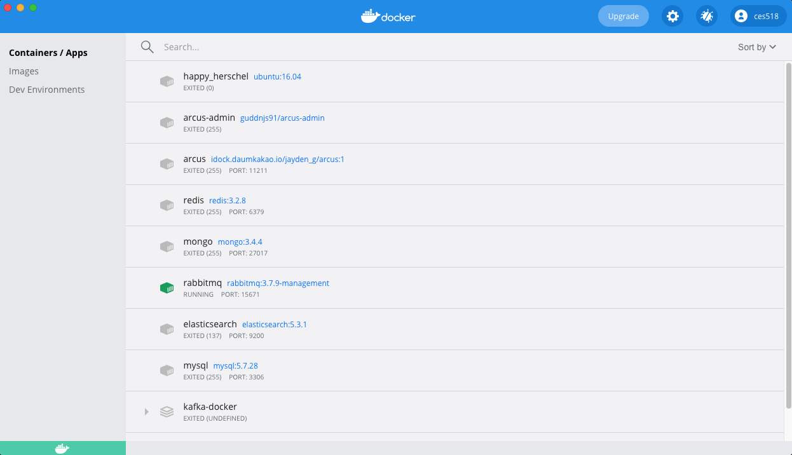

# 도커

## 도커 설치
- https://www.docker.com/

## 도커 Dashboard




- Container Engine 에 할당한 리소스 설정


- 외부 Registry 설정


- 정석대로라면, 쿠버네티스 클러스터를 별도로 구축해야하지만, Mini Kube 를 지원해준다. (Single Node)

## 도커 실행

`컨테이너 실행`
- docker run [OPTIONS] IMAGE[:TAG | @DIGEST] [COMMAND] [ARG..]
- run 명령어 실행시 Container 생성 및 실행 / 이미지가 없을 경우 Download 까지 실행
- TAG 를 명시하지 않으면 기본적으로 latest (버전과는 조금 다르지만 버전과 유사하다)

| 옵션 | 설명 |
| --- | --- |
| -d | detached mode 백그라운드 모드 |
| -p | 호스트와 컨테이너 포트를 연결 (포워딩) |
| -v | 호스트와 컨테이너의 디렉토리를 연결 (볼륨 마운트) |
| -e | 컨테이너 내에서 사용할 환경변수 설정 |
| -name | 컨테이너 이름 설정 |
| -rm | 프로세스 종료시 컨테이너 자동 제거 |
| -it | -i 와 -t 를 동시에 사용, 터미널 입력을 위한 옵션 (i : interactive, t : tty) |
| -link | 컨테이너 연결 [컨테이너명:별칭] |

`ubuntu 이미지 설치 및 실행`

```shell
docker pull ubuntu:16.04

docker images | grep ubuntu
ubuntu                                      16.04              065cf14a189c   3 weeks ago     135MB

// ubuntu:16.04 이미지 실행, 실행과 동시에 종료됨
docker run ubuntu:16.04

// 종료된 컨테이너 목록 확인
docker ps -a
CONTAINER ID   IMAGE                                 COMMAND                  CREATED         STATUS                       PORTS                                                                                                                      NAMES
09f9646ec0d0   ubuntu:16.04                          "/bin/bash"              3 minutes ago   Exited (0) 3 minutes ago
```
- 컨테이너에서는 프로세스를 지속적으로 실행할만한 커맨드가 존재해야 한다.
- 아래 이미지의 경우 ubuntu 가 실행된 이후 작업이 되어 있지 않아 바로 종료된다.