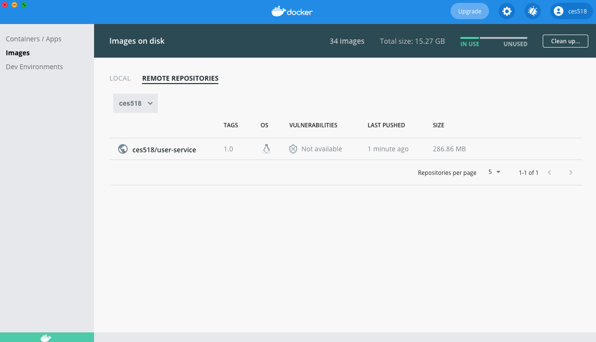

# 도커 이미지 생성 Public Registry Push

## Dockerfile for User MicroService
- User MicroService 를 Docker file 로 만들것
- java - openjdk 기반으로 생성

```dockerfile
FROM openjdk:17-ea-jdk-slim
# Container 내부 /tmp 디렉터리 생성
VOLUME /tmp
#target 의 파일을 Container 내부의 UserService.jar 로 복사한다.
COPY target/userservice-1.0.jar UserService.jar
# 복사된 jar 실행
ENTRYPOINT ["java", "-jar", "UserService.jar"]
```

```shell
// jar 생성
./mvnw clean compile package

// docker image 생성
docker build -t ces518/user-service:1.0

// docker image 확인
docker images
REPOSITORY                                  TAG                IMAGE ID       CREATED          SIZE
ces518/user-service                         1.0                17f128049b82   39 seconds ago   477MB

// docker image push
docker push ces518/user-service:1.0
```
- {docker hub account}/user-service:{tag-name}



`Docker Image 로 실행해보기`

```shell
// 기존에 LocalRepository 에 생성되어 있는 이미지 제거
// 이미지 제거시엔 Image ID 를 지정해야 한다.
docker rmi 17f128049b82

// docker hub 에서 image pull
docker pull ces518/user-service:1.0

// pull 확인
docker images
REPOSITORY                                  TAG                IMAGE ID       CREATED         SIZE
ces518/user-service                         1.0                17f128049b82   7 minutes ago   477MB

// run
docker run ce518/user-service:1.0

// ... 실행

  .   ____          _            __ _ _
 /\\ / ___'_ __ _ _(_)_ __  __ _ \ \ \ \
( ( )\___ | '_ | '_| | '_ \/ _` | \ \ \ \
 \\/  ___)| |_)| | | | | || (_| |  ) ) ) )
  '  |____| .__|_| |_|_| |_\__, | / / / /
 =========|_|==============|___/=/_/_/_/
 :: Spring Boot ::                (v2.5.1)

2021-07-10 11:41:04.514  INFO [user-service,,] 1 --- [           main] c.c.c.ConfigServicePropertySourceLocator : Fetching config from server at : http://127.0.0.1:8888
2021-07-10 11:41:04.698  INFO [user-service,,] 1 --- [           main] c.c.c.ConfigServicePropertySourceLocator : Connect Timeout Exception on Url - http://127.0.0.1:8888. Will be trying the next url if available
2021-07-10 11:41:04.698  WARN [user-service,,] 1 --- [           main] c.c.c.ConfigServicePropertySourceLocator : Could not locate PropertySource: I/O error on GET request for "http://127.0.0.1:8888/user-service/default": Connection refused; nested exception is java.net.ConnectException: Connection refused
2021-07-10 11:41:04.703  INFO [user-service,,] 1 --- [           main] m.j.userservice.UserServiceApplication   : No active profile set, falling back to default profiles: default
2021-07-10 11:41:07.994  INFO [user-service,,] 1 --- [           main] .s.d.r.c.RepositoryConfigurationDelegate : Bootstrapping Spring Data JPA repositories in DEFAULT mode.
2021-07-10 11:41:08.278  INFO [user-service,,] 1 --- [           main] .s.d.r.c.RepositoryConfigurationDelegate : Finished Spring Data repository scanning in 272 ms. Found 1 JPA repository interfaces.
2021-07-10 11:41:09.485  INFO [user-service,,] 1 --- [           main] o.s.cloud.context.scope.GenericScope     : BeanFactory id=7c96a3c4-a3ae-320c-a0a3-842300f8b967
2021-07-10 11:41:09.584  INFO [user-service,,] 1 --- [           main] faultConfiguringBeanFactoryPostProcessor : No bean named 'errorChannel' has been explicitly defined. Therefore, a default PublishSubscribeChannel will be created.
2021-07-10 11:41:09.610  INFO [user-service,,] 1 --- [           main] faultConfiguringBeanFactoryPostProcessor : No bean named 'integrationHeaderChannelRegistry' has been explicitly defined. Therefore, a default DefaultHeaderChannelRegistry will be created.
...
```