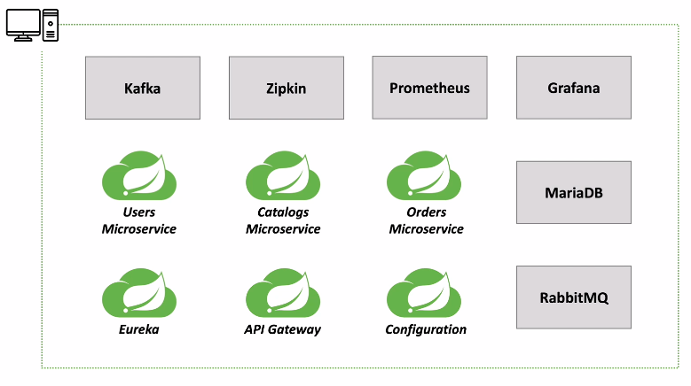

# 애플리케이션 배포 구성

## 배포 전략
- 로컬 / 클라우드 / 온프라미스 환경 으로 구분
  
`배포 방식 구분`

- Intellij + Local
- Jar + Local
- Docker + Local
- Docker + AWS EC2
- Docker + Docker Swarm Mode + AWS EC2 (최근에는 잘 사용하지 않음)
- Docker + Kube + AWS EC2 (거의 표준 으로 자리잡음)

## Running Microservices in Local



## Docker Network 
- 도커 네트워크를 이용해 각 컨테이너들이 통신할 수 있게 해야한다.
- 도커에서는 Bridge, Host, None 3가지 방식의 네트워크를 지원한다.
- **Bridge Network*8
    - 별다른 설정 없이 사용 가능
    - Host PC 와 상관없이, 가상의 네트워크를 구성하고 각 컨테이너들을 배치해서 사용하는 방식
    - docker network create --driver bridge [브릿지 명]
- **Host Network**
    - 호스트 네트워크를 같은 환경에서 사용하낟. 포트포워딩 X
- **None Network**
    - 네트워크를 사용하지 않는다.
    - I/O 네트워크만 사용, 외부와 단절된다.

`Docker Network 생성 및 확인`

```shell
// 네트워크 생성
docker network create ecommerce-network
d5fe90e8c54cbed4274b4d87b1ad47cf9492c2ddf13e8f2f201ce6e7621589ba

// 생성 확인
docker network ls
NETWORK ID     NAME                   DRIVER    SCOPE
83e6f5cbe942   bridge                 bridge    local
d5fe90e8c54c   ecommerce-network      bridge    local
b43bcbe9dced   host                   host      local
9838a0fb1a01   kafka-docker_default   bridge    local
ad13ad2d5d16   mariadb_backend        bridge    local
b171235fd1c7   none                   null      local
```

`Docker 불필요한 리소스 및 컨테이너 정리`

```shell
docker system prune
WARNING! This will remove:
  - all stopped containers
  - all networks not used by at least one container
  - all dangling images
  - all dangling build cache
```
- 사용하지 않는 컨테이너, 네트워크, 이미지, 캐시 등을 모두 제거한다.


`Docker Network 생성 시 gateway, subnet mask 지정`

```shell
docker network create --gateway 172.18.0.1 --subnet 172.18.0.0/16 ecommerce-network
54ee77113bc8feb13ba801527ce8e189b537ca55f7fef0093c9cfd6dee1617d0

docker network ls
NETWORK ID     NAME                DRIVER    SCOPE
83e6f5cbe942   bridge              bridge    local
54ee77113bc8   ecommerce-network   bridge    local
b43bcbe9dced   host                host      local
ad13ad2d5d16   mariadb_backend     bridge    local
b171235fd1c7   none                null      local

docker network inspect ecommerce-network
[
    {
        "Name": "ecommerce-network",
        "Id": "54ee77113bc8feb13ba801527ce8e189b537ca55f7fef0093c9cfd6dee1617d0",
        "Created": "2021-07-13T13:10:18.942476743Z",
        "Scope": "local",
        "Driver": "bridge",
        "EnableIPv6": false,
        "IPAM": {
            "Driver": "default",
            "Options": {},
            "Config": [
                {
                    "Subnet": "172.18.0.0/16",
                    "Gateway": "172.18.0.1"
                }
            ]
        },
        "Internal": false,
        "Attachable": false,
        "Ingress": false,
        "ConfigFrom": {
            "Network": ""
        },
        "ConfigOnly": false,
        "Containers": {},
        "Options": {},
        "Labels": {}
    }
]
```
- 컨테이너에서 수동으로 ip 지정시 오류가 발생할 수 있으므로 gateway, subnet mask 를 지정해 주는것이 좋음
- inspect 옵션을 사용하면 현재 생성된 네트워크의 설정 정보, 할당된 컨테이너 들의 정보 등을 확인할 수 있다.

`컨테이너에 대한 네트워크 사용시 장점`

- 일반적인 컨테이너는 독립적인 호스트 OS 라고 생각하면 된다. 고유 IP Address 를 가진다.
- 동일 네트워크 내에서 컨테이너들끼리는 컨테이너 ID / 컨테이너 이름을 통해 통신을 할 수 있다.
- 도커에서 IP 할당은 **비어있는 IP 에 대해 순차 할당** 한다.
    - 배포시 마다 항상 고정된 IP 로 할당되지 않을 수 있다. (IP 가 변경될 수 있음)
    - Eureka 가 가진 SERVICE-NAME 처럼 컨테이너 ID, 컨테이너 NAME 으로 통신이 가능하다.